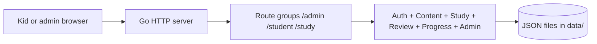
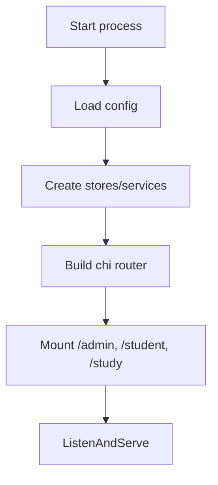
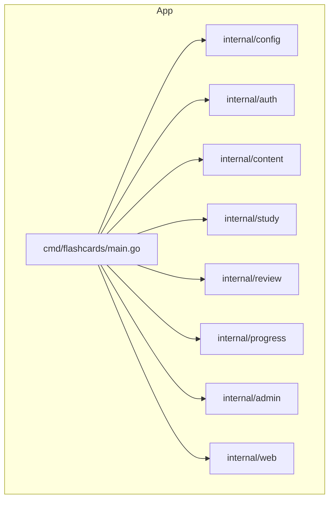
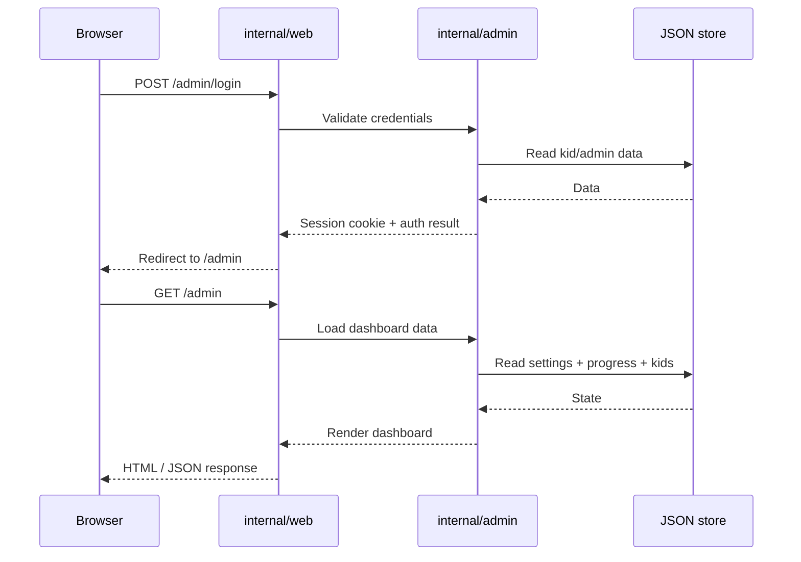
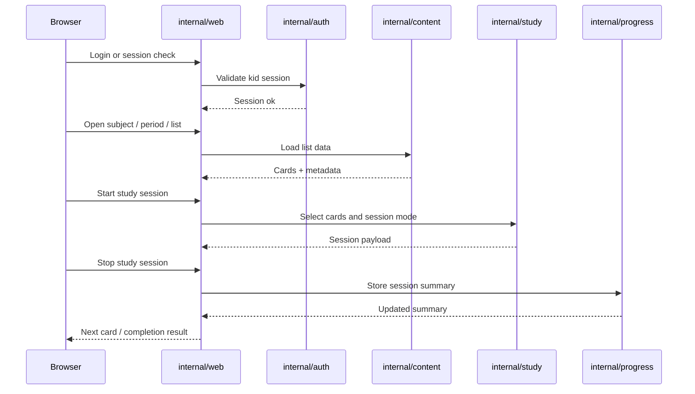
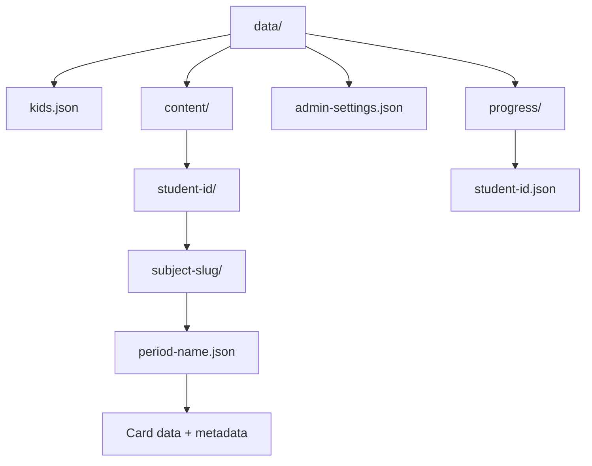
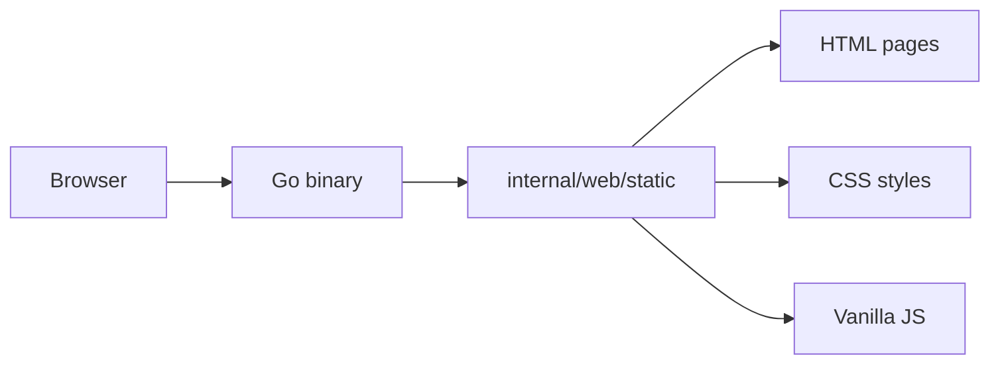
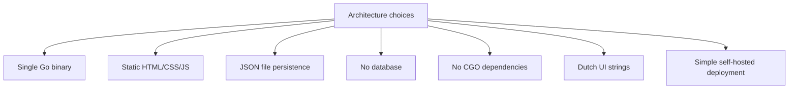

# Architecture overview

This application is a small, self-hosted Go service that serves a static Dutch-language web UI and stores study data as JSON files on disk. The design is intentionally simple: one binary, no database, no frontend framework, and clear separation between network handling, app services, and persistence.

## 1. System boundary

## 2. Runtime composition

The bootstrap path is centered in [cmd/flashcards/main.go](cmd/flashcards/main.go): it loads TOML config, instantiates the storage-backed services, mounts the routes, and starts the HTTP server.

## 3. Service map

### Responsibilities

- [internal/config](internal/config): TOML config loading and validation
- [internal/auth](internal/auth): kid accounts, PIN login, approval, sessions
- [internal/content](internal/content): subjects, periods, lists, cards, CSV/JSON import
- [internal/study](internal/study): session selection and study behavior
- [internal/review](internal/review): scheduling and repeated review logic
- [internal/progress](internal/progress): progress persistence and summaries
- [internal/admin](internal/admin): admin dashboard data, settings, management operations
- [internal/web](internal/web): route handlers, rendering, and static asset serving

## 4. Request flow

### Admin flow

### Student study flow

## 5. Data architecture

The application stores content in a simple filesystem layout rather than a database.

### Storage principles

- Each student gets an isolated area under `content/<student-id>`
- Subject and period are structured as folders and JSON files
- Lists contain cards, metadata, typing settings, and timestamps
- Account data is stored in `kids.json`; progress and admin settings use dedicated JSON files
- The model favors reviewability, backups, and easy debugging over complex relational structure

## 6. Frontend architecture

The UI is static HTML/CSS/JS served by the Go binary. There is no Node build pipeline and no JavaScript framework.

### Why this matters

- deployment stays simple
- the app can run as a single binary
- UI assets are easy to inspect and tweak directly
- the project remains compatible with the v1 self-hosted deployment model

## 7. Boundary constraints

The architecture is intentionally narrow because of the repository constitution.

## 8. Design summary

The system follows a classic layered approach:

- web layer handles HTTP and page rendering
- domain services enforce business rules
- storage layer persists JSON state without a DB
- the static frontend keeps deployment and maintenance lightweight

This architecture is deliberately optimized for a small family study app: easy to run, easy to inspect, easy to deploy, and aligned with the product goals documented in [openspec/project.md](openspec/project.md).
